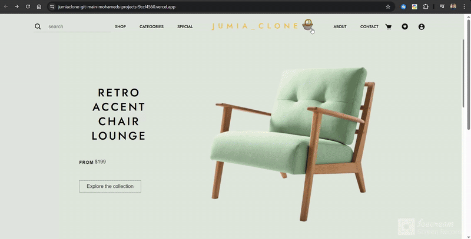

.


# 🛒 Test Commerce - Flask E-commerce Project

A simple e-commerce-style web app built with **Flask**, designed to display product categories, items, and blog-style posts using Flask framework in the backend,frontend designed using [telepothq](https://teleporthq.io/) and,I've integrated some data unsing [ Dummyjson API](https://dummyjson.com/) .

## 📁 Project Structure
/ <br>
│ <br>
├──vercel.json<br>
├── app.py <br>
├── requirements.txt <br>
│ <br>
├── static/ <br>
│   ├── 404.css <br>
│   ├── index.css <br>
│   ├── products.css <br>
│   ├── style.css <br>
│   ├── components/ <br>
│   │   ├── blog-post-card.css <br>
│   │   ├── blog-post-card.html <br>
│   │   ├── category-card.css <br>
│   │   ├── category-card.html <br>
│   │   ├── item-card.css <br>
│   │   ├── item-card.html <br>
│   │   ├── section-heading.css <br>
│   │   ├── section-heading.html <br>
│   ├── images/ <br>
│       ├── fragrances.png <br>
│       ├── groceries.png <br>
│       ├── koffa_logo.png <br>
│       ├── makeup.png <br>
│ <br>
├── templates/ <br>
│    ├── 404.html <br>
│    ├── beauty.html <br>
│    ├── furniture.html <br>
│    ├── groceries.html <br>
│    ├── index.html <br>
## 🛠️ Installation

1. **Clone the repository**:
   ```bash
   git clone https://github.com/mouhamedmef/E-commerce-Web-site.git
2. **Create a virtual environment**:

   ```bash
   python -m venv venv
   source venv/bin/activate  
   (On Windows use: venv\Scripts\activate)
3. **Install dependencies**:

   ```bash
    pip install -r requirements.txt

4. **Run the app**:
    ```bash
    flask run
## 📸 Screenshots

